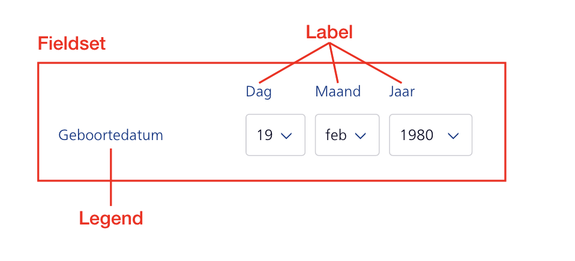
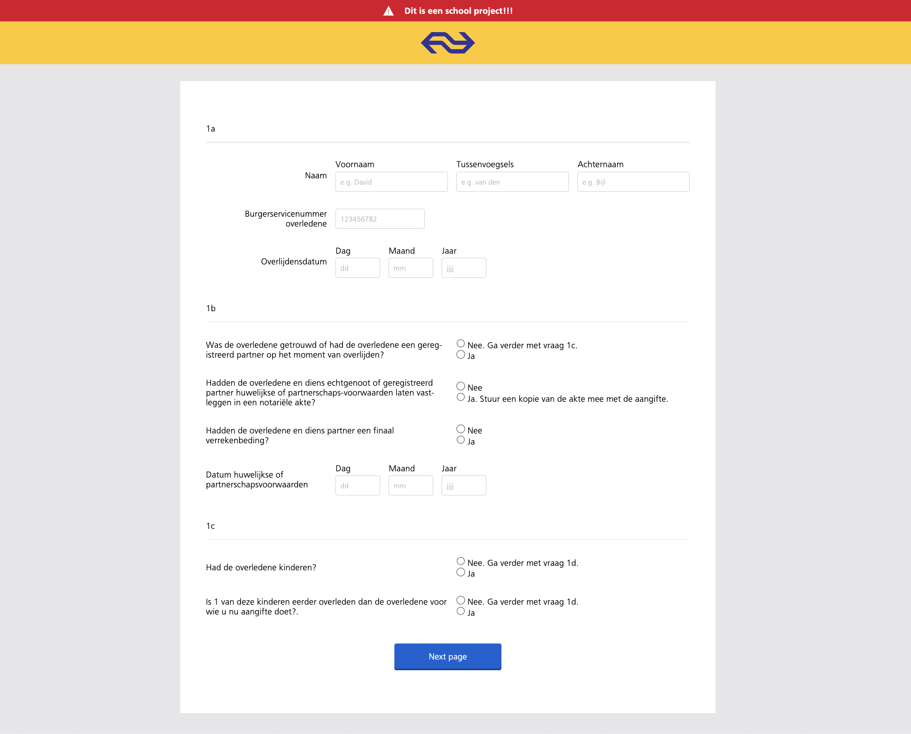
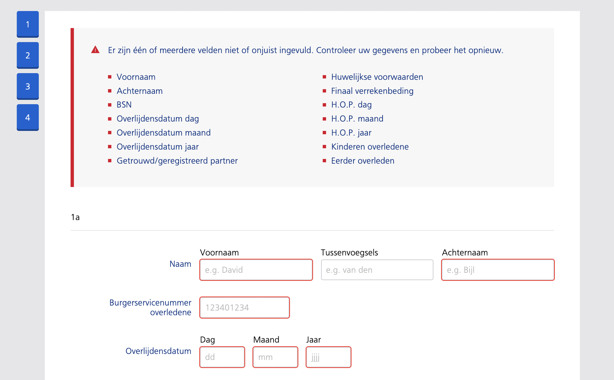

# Browser technologies <br> David Bijl

<br>
<br>
<br>

> ## Week 1
> **<sub><sup>24 feb t/m 28 feb</sup></sub>**

**Assignment:** <br>Belasting formulier bouwen in de huisstijl van NS

**Nieuw voor mij:** <br>
<ul>
<li>Width & height in html = good practise</li>
<li><code>:target</code></li>
<li><code>fieldset</code> & <code>legend</code></li>
<li>De verschiilende input types</li>
<li><code>details name="naam"</code></li>
<li><code>::backdrop</code></li>
<li>Data attribute's toevoegen</li>
</ul>

**Progressie:** <br>
Deze week ben ik begonnen met een eerste opzet van het formulier. Hierdoor kwam ik in aanraking met de `fieldset`'s en `legend`'s. Ik denk dat ik nu beter begrijp hoe en wanneer ik deze tags moet gebruiken.

Tot nu toe ben ik nog niet bezig met de meer geavanceerde aspecten, zoals progressive enhancement. In plaats daarvan richt ik me op het oriënteren, begrijpen van de opdracht en het opbouwen van de eenvoudigere inputvelden.

Daarnaast heb ik de styleguide van NS gevonden en de NS Sans-font alvast aan mijn document gekoppeld.

---

<br>
<br>
<br>

> ## Week 2
> **<sub><sup>3 t/m 7 mar</sup></sub>**

**Nieuw voor mij:** <br>
<ul>
    <li><code>legend</code> tag stylen (is nogsteeds niet helemaal duidelijk)</li>
    <li>De <code>select</code> tag en de <code>optgroup</code> tag</li>
    <li>De volgende input types:
    <ul>
        <li><code>range</code></li>
        <li><code>file</code></li>
        <li><code>image</code></li>
    </ul>
    </li>
    <li>De <code>textarea</code> tag</li>
</ul>

**Progressie:** <br>
Ik ben deze week verder gegaan met het uitwerken van de eerste paar invoervelden (1a, 1b en 1c). Deze waren relatief simpel, maar een goede oefening om kennis te maken met de verschillende inputtypes. Ik heb al een aantal voorbeelden van progressive enhancement kunnen verwerken, namelijk: <sub><sup>*Nee. Ga verder met vraag 1c.*</sup></sub> & <sub><sup>*Stuur een kopie van de akte mee met de aangifte.*</sup></sub>. Deze heb ik werkend gemaakt met de `:has`-selector.

``` css
  .one-b:has(.skip:checked)>*:nth-of-type(n + 2) {
    opacity: .3;
    pointer-events: none;
  }
```

Ergens waar ik tegenaan liep deze week was:
Het stylen van `legend` elementen. Ik ben erachter gekomen dat het (in chrome in ieder geval) best lastig is om een `legend` te positioneren met bijvoorbeeld flex of grid. Het element lijkt niet te luisteren en blijft altijd een regel boven de andere content staan.
Na wat rond te zoeken vond ik een paar workarounds:
1. Ik kan de `legend` tag `display: contents;` geven. Van wat ik begrijp, is dit een soort alternatief voor `display: none;`, maar dan blijft het element visueel zichtbaar(?). In ieder geval zorgt het ervoor dat het zich houdt aan de `display: grid;` van de parent. Het probleem is echter dat de tag (volgens MDN en ‘Chad’) zijn semantische waarde verliest. Dit leek me dus geen goede optie.
2. De `legend` wrappen in een `span` of ander container-element en deze positioneren. Dit werkt ook, maar hierdoor is de `legend` geen direct kind meer van de `fieldset`. Ik vroeg me af of dit de semantische waarde van de `legend` verpest? Zo ja, is er een betere manier om de layout te bouwen?<br>

Dit is de layout die ik probeer na te bouwen:<br>
<br>

Uiteindelijk heb ik ervoor gekozen om de `legend`-elementen te wrappen en ze op die manier te stylen. Dit ging verder goed, en nu heb ik een overzichtelijkere structuur in mijn document.<br>
<br>

---

<br>
<br>
<br>

> ## Week 3
> **<sub><sup>10 t/m 14 mar</sup></sub>**

**Progressie:** <br>
**Update legend - span situatie:**  
Na mijn vraag te hebben voorgelegd aan Krijn en Sanne, ben ik erachter gekomen dat het stylen van `legend`-elementen gewoon lastig is. Sanne vertelde me dat de eenvoudigste oplossing als volgt is:

```html
<fieldset data-legend="Titel">
  <legend class="visually-hidden">Titel</legend>
  ...
</fieldset>
```

``` css
.visually-hidden {
  clip: rect(0 0 0 0);
  clip-path: inset(50%);
  height: 1px;
  overflow: hidden;
  position: absolute;
  white-space: nowrap;
  width: 1px;
}

fieldset::before {
  content: attr(data-legend);
}
```

Met deze methode vervangen we de `legend` in principe door een `::before-element` en maken we de echte `legend` onzichtbaar. Hij blijft echter wel aanwezig, zodat de code voldoet aan de W3C-regels. Deze oplossing werkt, maar ik heb ervoor gekozen om mijn code met `span`-elementen te behouden. Volgens Sanne is dit namelijk nog steeds "vieze HTML".<br>

Verder ben ik deze week bezig geweest met de validatie van het formulier. Hiervoor heb ik de JavaScript Validation API gebruikt en CSS-styling toegepast:

``` css
input:user-valid {
  border-left: 5px #009A42 solid !important;
  background-image: url('/images/valid.png');
  background-repeat: no-repeat;
  background-position: right 10px center;
  background-size: 10px;
}

input:user-invalid {
  border-left: 5px #DB0029 solid !important;
  background-image: url('/images/error.png');
  background-repeat: no-repeat;
  background-position: right 10px center;
  background-size: 15px;
}
```

Naast de validatie heb ik tijdens de les samen met Krijn mijn pagina getest op een oud apparaat. Hieruit kwamen een aantal interessante bevindingen. De belangrijkste was dat de pagina er erg kaal uitzag. Dit kwam doordat ik overal `custom properties` had gebruikt, die natuurlijk niet worden ondersteund op oudere apparaten/browsers. Daarom heb ik besloten om alle `custom properties` te vervangen door HEX-waarden.

Verder bleek dat de meeste progressive enhancements goed waren geïmplementeerd, op één klein stukje na:

```css
/* Gecorrigeerde code ↓↓↓ */
.fine {
  display: none;
}

@media (pointer: fine) {
  .coarse {
    display: none !important;
  }

  .fine {
    display: flex !important;
  }
}

@media (pointer: coarse) {
  .fine {
    display: none !important;
  }

  .coarse {
    display: flex !important;
  }
}
```

Voorheen ontbrak er een standaardwaarde. Hierdoor zou er in browsers die geen `@media` ondersteunen dubbele code worden weergegeven.<br>
Misschien valt op dat ik `!important` gebruik. Ik ben me ervan bewust dat dit niet de ‘netste’ oplossing is. De specificiteit van de `class` was niet hoog genoeg om de styles te overschrijven, maar uit gemak heb ik het zo gelaten.

---

<br>
<br>
<br>

> ## Week 4
> **<sub><sup>17 t/m 21 mar</sup></sub>**

**Progressie:** <br>  
In week 4 heb ik gewerkt aan het responsive maken van de pagina. De standaard styling is gericht op mobile, en met een `@media query` wordt extra styling toegepast voor schermen breder dan 700px.  

Daarnaast heb ik deze week de content voor pagina 3 toegevoegd. Hier heb ik een nieuw patroon uitgewerkt waarbij de gebruiker de gegevens van de verkrijger(s) moet invullen. Voor deze functionaliteit heb ik een stuk JavaScript gegenereerd met AI. Uiteindelijk bleek de implementatie steeds complexer te worden, waardoor ik heb besloten het los te laten. Ondanks dat ben ik nog steeds trots op het patroon en de UX-uitwerking, al kan ik helaas niet alle credits nemen voor de code.  

Naast pagina 3 heb ik ook gewerkt aan de validatie van het formulier. Een extra feature die ik heb toegevoegd, is dat de gebruiker een foutmelding bovenaan de pagina krijgt wanneer velden onvolledig of incorrect zijn ingevuld. Dit overzicht toont alle fout ingevulde velden, zodat de gebruiker direct ziet wat er aangepast moet worden.  

<br>  
<br>  

Tot slot heb ik een local storage-feature toegevoegd aan het formulier, zodat de ingevoerde gegevens van de gebruiker worden onthouden – zelfs als de gebruiker de pagina verlaat. Daarnaast heb ik nog een heleboel kleine visuele verbeteringen doorgevoerd om de interface verder te verfijnen.

---

<br>
<br>
<br>

> ## Bronnen

<ul>
    <li>ChadGPT -> voor allerlei kleine HTML en CSS controles een vraagjes & voor hulp met javascript (staat aangegeven in de JS comments)</li>
    <li>https://developer.mozilla.org/en-US/docs/Web/API/Window/matchMedia -> om @media queries in javascript te kunnen checken</li>
    <li>https://developer.mozilla.org/en-US/docs/Web/CSS/@media/pointer -> informatie over de @media query die luisterd naar de pointer van de gebruiker</li>
    <li>https://www.w3schools.com/html/html_form_input_types.asp -> een lijst van alle input types</li>
    <li>https://developer.mozilla.org/en-US/docs/Learn_web_development/Extensions/Forms/Form_validation -> form validation</li>
    <li>https://developer.mozilla.org/en-US/docs/Web/CSS/:user-valid -> user valid styling</li>
    <li>https://www.youtube.com/watch?v=DNXEORSk4GU -> popover uitleg video</li>
    <li>https://github.com/oddbird/css-anchor-positioning -> polyfill voor anchor positions</li>
    <li>https://www.w3schools.com/cssref/sel_target.php -> uitleg over :target</li>
    <li>Docenten -> uitleg over allerlei onderwerpen</li>
</ul>

---